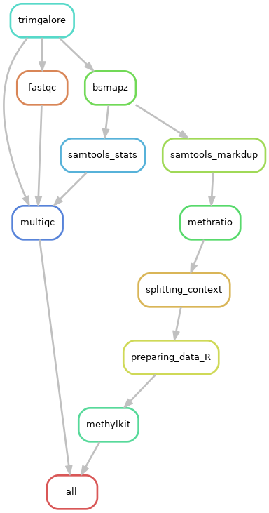
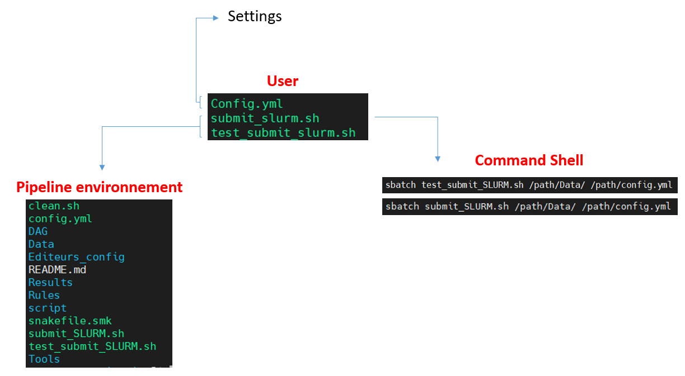

# Pipeline detection DNA methylation : **DNAmethBS**        

A bioinformatics pipeline for the detection of DNA methylation from WGBS and MC-Seq sequencing data. This pipeline, adapted to the needs of the EpiTree project, can be fully transposed to other methylation datasets in plants.

# **EpiTree project ANR**

## Authors

* Abdeljalil SENHAJI RACHIK, https://github.com/abdeljalil-senhaji

## Usage

In any case, if you use this workflow in a paper, don't forget to give credits to the authors by citing the URL of this (original) repository and, if already available, its DOI (see above).


#### Step 1: Obtain a copy of this workflow

> **Note:**


## Description

                                                                    

This pipeline is based on Snakemake. It is able to detect DNA methylation in trees with associated R and python scripts. 5 steps:

- Cleaning of raw data followed by quality control
- Alignment with a reference genome
- Elimination of duplications
- Detection of methylated cytosines (mC) in the three methylation contexts
- Basic statistical analyzes on the detection of methylations


```
Commande line 
``` 
## System requirements

Here is the list of tool dependencies with the version tested and used for the pipeline.
Absolute paths must be precise in the config.yaml file for the BSMAPZ tool is not installed in the CEA cluster environment.

- module load **snakemake** / 5.11.2
- module load **rstudio** / 1.3.1093 >>>> package ??
- module load **gnuplot** / 4.6.2
- module load **pigz** / 2.4 module
- module load **trimgalore** / 0.6.5
- module load **fastqc** / 0.11.9
- moduel load **multiqc** / 1.9
- module load **samtools**  / 1.11

## 1. file configuration

The user should use the config.yaml file to provide all the necessary inputs for the pipeline:
> the necessary path
- **path-work-env**: working environment
- **pathresults**: environment of the results
- **pathdada**: the data folder path
- **REF_GENOME**: the reference fasta file path
> the parameters and options of the tools:
- ERROR_RATE: 0.1
- LENGTH: 36
- QUALITY: 20
- ADAPT1: --illumina
- ADAPTER2: AAATCAAAAAAAC
> Snakemake options:
- wildcard
- NBSAMPLE:
- THREADS:
> paths to tools:
- tools:


The config.yaml can also be used to modify the parameters (mainly the call of the quality threshold), to define the cluster resources for each program.


## Configure pipeline and run



Pipeline Folder File:
- Results: results folder
- DAG: file for the graphical representation of the pipeline there is a script for the generation of the two histograms at the same time - slurm: File for the generation of information on the resources consumed by the pipeline (CPU, MEM, calculation time ... )
- Rules: folder that contains each pipeline rule independently (another way to create rules under snakemake)
- script: folder that contains the scripts created for our pipeline
- Logs: folder where there is the output of the log files for each sample are used for checking if there is an error is that thanks to the command FG-SAR created by the developers of CEA)
- benchmarck: folder that contains information on resources (snakemake object)
- DATA: folder where there are the samples (I put 2 samples with 1000bp just for the pipeline test)
- Config_editeur: scripts for adapting VIM editors to be adapted with snakemake


Pipeline Environment File
- test_submit_SLURM.sh: script sbatch of job submission for pipeline test
- submit_SLURM.sh: job submission script
- config.yaml: configuration file
- snakefile.smk: file where there are all the pipeline rules.

submit_SLURM.sh and test_submit_SLURM.sh are specific to the SLURM cluster. Therefore, if you are using another cluster, you must create other files.


This is the official Snakemake documentation if you need more information: https://snakemake.readthedocs.io/en/stable/tutorial/tutorial.html
